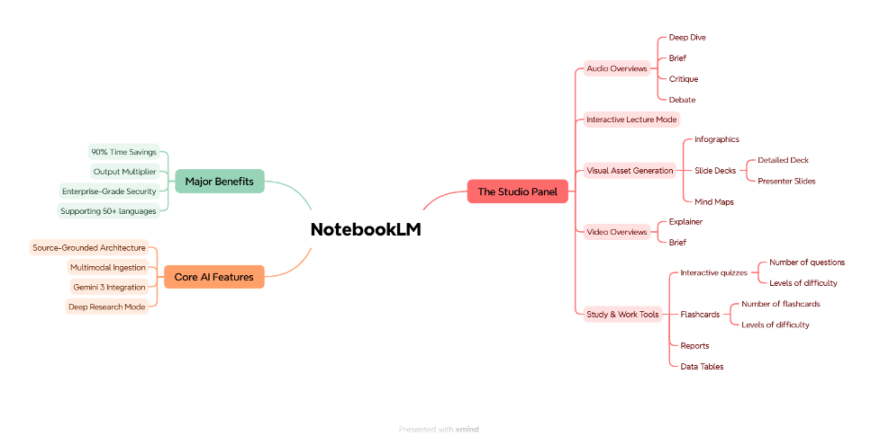
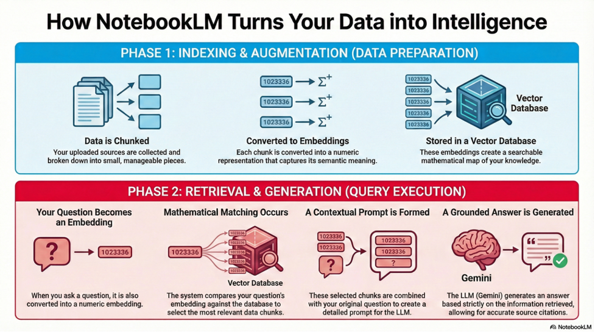
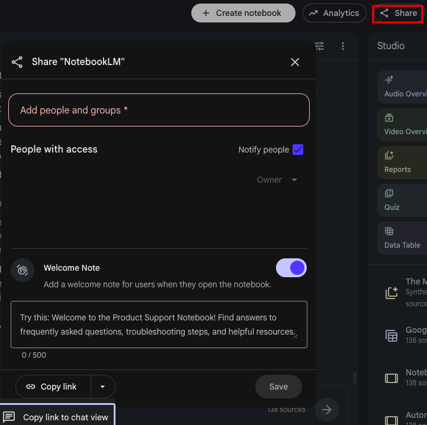

++++

++++

image::../../images/header.jpg[Hat, width=100%]

= Theory. Core Features and Benefits

== Introduction

Turn your information overload into the greatest competitive advantage. 

This unit introduces *NotebookLM — a transformative engine* that converts fragmented data into a cohesive knowledge ecosystem. 

NOTE: We’ve prioritized this tool because it offers something rare: AI intelligence combined with rigorous factual accuracy and data privacy.

You will *learn how to delegate 90% of your research routine to AI*, allowing you to focus on high-level strategy while building a scalable system for your intellectual capital.

====

====

== Important ideas
Before we fire up the engine, we need to speak its language. Think of this as learning the dashboard of a supercar: once you master the *Core Terms*, you stop manually digging through files and start driving a *Cognitive Infrastructure*. 

_It’s like choosing a book yourself versus having the right one handed to you, while your data stays private._ 

=== Key Terms

++++
<iframe id="cards-frame"
        src="interactives/theory/key-terms.html" 
        style="width: 100%; border: none; overflow: hidden;"
        scrolling="no">
</iframe>
++++

== The Technical Workflow: Inside the "Cognitive Engine"
The RAG process operates in *two distinct phases* to transform your unstructured data into usable intelligence..

++++
<iframe id="workflow-frame"
        src="interactives/theory/phases.html" 
        style="width: 100%; border: none; overflow: hidden;"
        scrolling="no">
</iframe>
++++

====

====

== Technical Limitations and the "Probabilistic" Nature
While the *RAG mechanism* significantly reduces hallucinations, it is *not perfect*. The actual generation of the final answer still relies on the *probabilistic nature* of next-word prediction algorithms inherent in LLMs. 

This means that while the AI is constrained by your data, *it can still occasionally produce incorrect information*, making the platform’s citation system a critical tool for your team to *verify the accuracy of high-stakes technical data*.

== Sharing

Share Notebook in NotebookLM lets you share your notebooks with colleagues for collaborative work.

*Options*:

* *Viewer* – colleagues can read your notebook but cannot make changes.

* *Editor* – colleagues can read and edit the notebook, enabling real-time collaboration.

You can also add a _welcome note_ to guide your teammates, making it clear how they should use or contribute to the notebook.

== Conclusion
*The goal here is simple*: _don’t treat NotebookLM like a digital scratchpad but use it as a full-scale Production Engine_. 

By feeding the model your own "ground truth" — client specs, API docs, or raw transcripts — you effectively kill off generative drift (hallucinations). 

IMPORTANT: You get the accuracy needed for complex outsourced projects, without putting your company’s data at risk. Your information stays private, the results stay reliable, and your workflow stays stable.

== Check yourself. Advanced RAG (Quiz)

++++
<iframe id="workflow-frame"
        src="interactives/theory/check-yourself.html" 
        style="width: 100%; border: none; overflow: hidden;"
        scrolling="no">
</iframe>
++++

== Further reading
https://medium.com/@jimmisound/the-cognitive-engine-a-comprehensive-analysis-of-notebooklms-evolution-2023-2026-90b7a7c2df36[The Cognitive Engine: A Comprehensive Analysis of NotebookLM’s Evolution (2023–2026)^]

https://www.reddit.com/r/AISEOInsider/comments/1pu66ze/notebooklm_updates_google_just_made_research/[NotebookLM Updates: Google Just Made Research Automatic^]

https://blog.google/innovation-and-ai/models-and-research/google-labs/notebooklm-custom-personas-engine-upgrade/[Chat in NotebookLM: A powerful, goal-focused AI research partner^]

== Summary
++++
<iframe src="/util/scripts/summary.html" style="width: 100%; border: none; overflow: hidden; min-height: 150px;" scrolling="no"></iframe>
++++

====

image::../../images/footer.png[Under, width=100%]

++++

++++